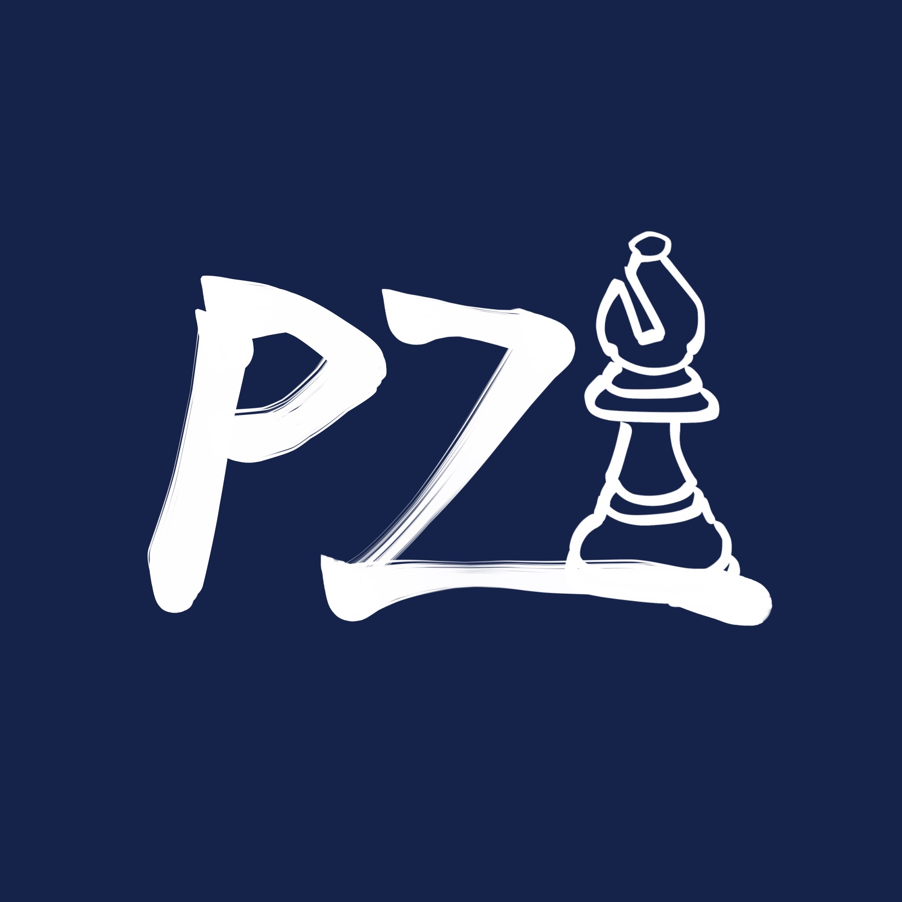

# PZChessBot




A chess engine created by two high school students, started when we were in middle school!

[Play against PZChessBot!](https://lichess.org/@/PZChessBot)

## Installation

For a non-development build, simply navigate to the [releases page](https://github.com/kevlu8/PZChessBot/releases) and download the latest release.

For the latest development build, you can clone the repository and build it yourself:

1. Clone the repository:

```bash
git clone https://github.com/kevlu8/PZChessBot.git
```

2. Download the latest NNUE model from [PZChessBot-Networks](https://github.com/kevlu8/PZChessBot-Networks/releases) and place it in the `PZChessBot` folder. Make sure the model is named `nnue.bin`.

3. Build the engine:

```bash
make -j
```

## Strength

|      Version     | CCRL Blitz | CCRL 40/15 | CCRL 40/15 4CPU | Ipmanchess R9 |
| ---------------- | ---------- | ---------- | --------------- | ------------- |
| v20250311T07     |   ~1900    |     -      |        -        |       -       |
| v1.0             |    2712    |     -      |        -        |       -       |
| v20250421T23-dev |   ~3000    |     -      |        -        |       -       |
| v2.0             |    2986    |     -      |        -        |       -       |
| v20250621T09-dev |   ~3100    |     -      |        -        |       -       |
| v20250623T22-dev |   ~3160    |     -      |        -        |       -       |
| v3.0             |    3305    |    3275    |        -        |       -       |
| v20250729T08-dev |   ~3400    |     -      |        -        |       -       |
| v4.0             |    3444    |    3374    |        -        |       -       |
| v5.0             |    3457    |    3396    |        -        |       -       |
| v6.0             |    3597    |    3491    |        -        |       -       |
| v6.1             |   ~3630    |    3504    |      3573       |       -       |
| v20260313-dev    |   ~3660    |     -      |        -        |       -       |
| v7.0             |    3701    |    3573    |      3607       |       -       |
| v7.1             |    3712    |    3585    |      3618       |      3505     |

## Logistics & Features

PZChessBot is a basic negamax engine.

### Search

- Basic alpha-beta pruning
- Quiescence search
- Principal-Variation Search
- Late-move reductions
- Late-move pruning
- Transposition tables
- Null-move pruning
- Move ordering using MVV+CaptHist, killer moves, butterfly history, and continuation history
- Aspiration windows and iterative deepening
- Internal iterative reductions
- Reverse futility pruning
- Razoring
- Singular extensions
- Multi-cut pruning
- Negative extensions
- History pruning
- Static exchange evaluation pruning
- QS futility pruning
- Static evaluation correction history (pawn, non-pawn, major, minor, continuation)
- TT-corrected evaluation
- Mate-distance pruning
- Improving heuristic
- Multithreading with Lazy SMP
- ProbCut

### Moves and board representation

- Hybrid bitboard + mailbox representation
- PEXT bitboards for lightning fast move generation

### Evaluation

- NNUE-type evaluation with horizontal mirroring
- Runs a (768x16hm+60144->768)x2pw->(16x2->32->1)x8 model
- Trained from zero-knowledge using self-play games

### Special Thanks

- The [Stockfish Discord Server](https://discord.gg/XUyHyT5ap9), specifically `#engines-dev` for their help!
- The [bullet](https://github.com/jw1912/bullet) NNUE trainer
- The [ChessProgramming Wiki](https://chessprogramming.org/) for their clear albeit outdated explanations
- [OpenBench](https://github.com/AndyGrant/OpenBench) for providing an excellent testing GUI
- [sscg13](https://github.com/sscg13) for having shared an OpenBench instance with me and helping me with a lot of miscellaneous stuff
- [Jonathan Hallström](https://github.com/JonathanHallstrom) for donating hardware and giving lots of advice
- [Pyrrhic](https://github.com/AndyGrant/Pyrrhic) for providing tablebase probing code
- Lastly, YOU for checking out this project!
